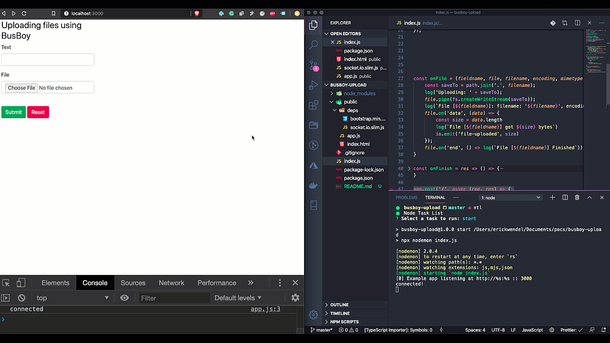

# Busboy + Socket Upload Status

This project was built to show how to upload files using Busboy and then emit status events throught channels on Socket.io

## Demo

## Running

- `npm install`
- `npm start`

Go to [http://localhost:3000](http://localhost:3000)
